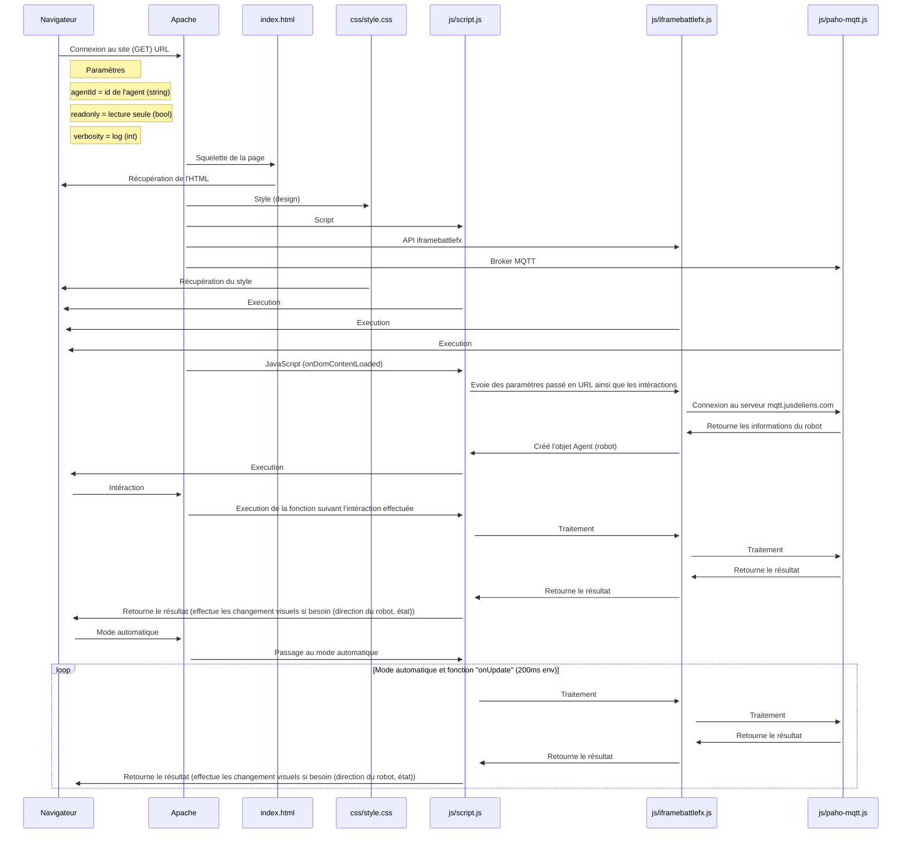

# IframeBattlefX

  
  

## Introduction

Le projet **IframeBattlefX** consiste en un **site web** possédant une **interface reliée à un robot** contrôlé par un **utilisateur en mode manuel** et avoir un **mode automatique**, pour que ce dernier puisse **combattre dans une arène**, cette dernière étant gérer par un **administrateur**.

Le **client** demande à ce que le robot ait un **thème unique**, une couleur différente suivant l'**état en temps réel du robot**, pouvoir **tirer**, avoir des **mélodies uniques** selon le **thème choisie** et ce pour **chaques états** ("tirer", "déplacement", "perte de vie", "mort", "rotation").

Le **Javascript** sera le language utilisé pour **contôler** le robot, **émettre la couleur** et **les mélodies** suivant l'**état de ce dernier** ainsi que pour **récupérer les informations en temps réel** ("état", "munition", "point de vie") le **HTML** et **CSS** serviront quand à eux à **afficher** et **styliser** (la mise en page) les **informations récupérées** en **javascript** et permettre l'utilisation sur différents appareils ("**PC**", "**Tablette**" et "**Téléphone**".

## User Story
 
En tant qu'utilisateur je veux avoir
* Une **couleur qui se démarque** suivant l'état du robot
* Voir les informations sur l'**état du robot**, de **ses munitions** et son **nom**
* **Des mélodies simples** et **reconnaissables** suivant le **thème choisi** et l'**état du robot**
* Un robot ayant **l'apparence du thème choisi** en vue du dessus
* Une interface de **commande à distance** facile d'accès, permettant les **déplacements** selon les points **cardinaux** ("Est", "Sud", "Ouest" et "Nord") et la **rotation**
* Un **mode manuel** ou **automatique** en **"supervision"** et seulement le **mode autonome** en **"iframe"**
* Un site **ergonomique** et **responsive** sur **une seule page**
* Être **responsive** (s'afficher en fonction de l'appareil utilsé, "***PC**", "**Tablette**" et "**Téléphone**")
* Le contrôle **manuel** ne pourra se faire que si l'**appareil utilisé le permet**
* La version **"iframe"** devra simplement contenir le **nom**, **l'état**, les **munitions**, faire les **mélodies** et voir le **robot (vue du dessus)**

En tant qu'administrateur je veux avoir:

* Récupérer le nom du robot par **URL** (**GET**) et se **connecter automatiquement** à l'arène 
* Avoir un affichage **minimaliste** en mode **"iframe"** contenant seulement les informations **importantes***
* Afficher le robot selon le **thème choisi par le client** en vue du dessus
* Le robot ne devra pas **dépasser une case** de la **grille de l'arène** et s'**adapter** automatiquement à la taille de cette dernière

## Fariqué avec

Programmes utilisés:
* **[Figma](https://www.figma.com/)** (Conception de la maquette)
* **[Trello](https://trello.com/)** (Suivi du projet)
* **[Visual Studio Code](https://code.visualstudio.com/)** (Utilisé pour la programmation) 
* **[FileZilla](https://filezilla-project.org/)** (utilisé pour la mise en ligne des fichiers sur le serveur web)
* **[API IframeBattlefX](https://github.com/MaloCoccyx/IframeBattlefX/blob/main/js/iframebattlefx.js)** (API JavaScript pour intéragir avec le robot sur le serveur)
* **[Serveur pytactx Jusdeliens.com](http://jusdeliens.com/play/pytactx/)** (Utilisé pour voir l'arène (le serveur) sur lequel se connecte le robot)
* **[Python3](https://www.python.org/download/releases/3.0/)** (Utilisé pour le framework Flask et jouer les sons et lumières avec le robot)
* **[Flask](https://flask.palletsprojects.com/)** (Framework Web Python)
* **[Docker](https://www.docker.com/)** (Utilisé pour le serveur python (Python3 & Flask) et apprendre linux)

Languages utilisés:
* **HTML** et **CSS** (Conception du front-end)
* **Javascript** (Intéraction avec l'API et utilisation de DOM)
* **Python** (Utilisé pour jouer les mélodies et les lumières correspondant à l'état du robot)

## Auteur

**Guillaume Lequart** alias [Malo Coccyx](https://github.com/MaloCoccyx/ "@MaloCoccyx")
